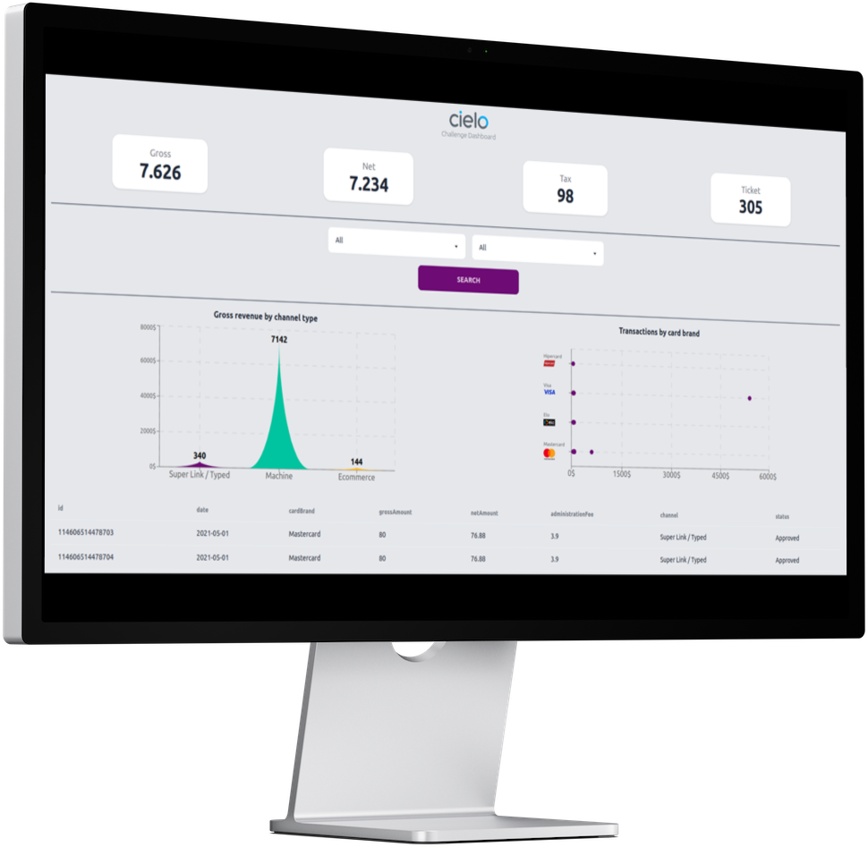
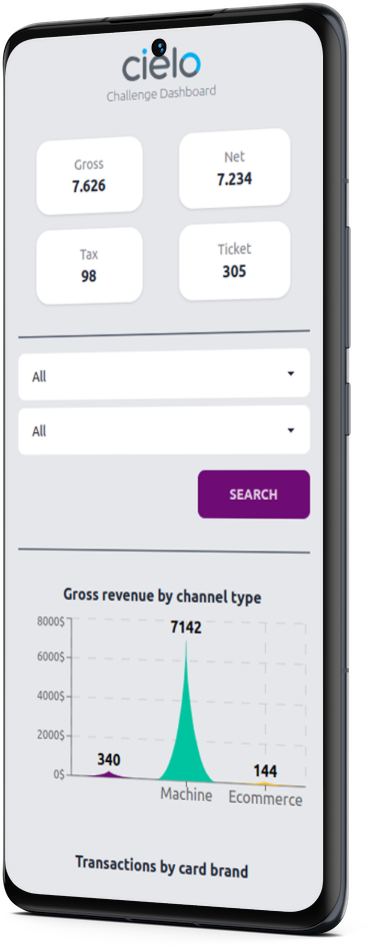
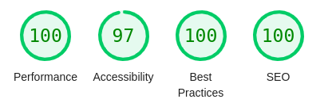

# Ada & Cielo Challenge

This project was carried out during a bootcamp with [Cielo](https://www.cielo.com.br/) and  [Ada](https://ada.tech/). The challenge is in the project's folder ([link](./Desafio_FrontEnd_v2.0.pdf)).

<br><br>
<div align="center" >
  
  &nbsp; &nbsp; &nbsp; &nbsp;
     
</div>
<br><br>

The project was crafted using the following technologies:
- <b>React:</b> A JavaScript library for building user interfaces.
- <b> Vite:</b> build tool, offering faster and more efficient development experiences.
- <b>TailwindCSS:</b> A low-level, utility-first CSS framework.
- <b>DaisyUI:</b> A set of UI components tailor-made for TailwindCSS,
- <b>Recharts:</b> A re-usable chart library for React.
- <b>Zustand:</b>  An elegant solution for state management, ensuring smooth state transitions and updates.
- <b>Vitest and React Testing Library:</b> for unit tests
- <b>Express and Routing Controllers:</b> Backend API

## API
It has a single endpoint `{{apiUrl}}/transactions`, which can accept query parameters such as `status` and `cardBrand` as a query param. It will then return the filtered data based on ([json](./server/src/data/data.json)) from challenge.

### Acceptable Query Parameters
- <b>status:</b> The status field is derived from the `StatusTransaction` interface. I plan to provide translations for these values in the future. The current acceptable values, along with their english correspondences, are: 
  - <b>Aprovada:</b> ("Corresponds to Approved")
  - <b>Pendente:</b> ("Corresponds to Pending")
  - <b>Negada:</b> ("Corresponds to Denied")

- <b>cardBrand:</b> Based on the CardBrand interface. Acceptable values are:
  - <b>MasterCard</b>
  - <b>Elo</b>
  - <b>Visa</b>
  - <b>Hipercard</b>
  - <b>Others</b>

*example:*
```
GET {{apiUrl}}/transactions?status=Pendente&cardBrand=Visa

returns: 
  {
    "transactions":[{
      "id":"114606514478692",
      "merchantId":"2000463023",
      "paymentNode":485173,
      "cnpjRoot":485116,
      "date":"2021-05-26T12:12:55",
      "paymentType":"Crédito à vista",
      "cardBrand":"Visa",
      "authorizationCode":"378154",
      "truncatedCardNumber":"7972",
      "grossAmount":64,
      "netAmount":61.5,
      "terminal":"32668",
      "administrationFee":3.9,
      "channelCode":1,
      "channel":"Máquina",
      "withdrawAmount":0,
      "minimumMDRAmmount":0,
      "mdrTaxAmount":0,
      "mdrFeeAmount":-2.5,
      "status":"Pendente"
    }],
    "totals":{
      "grossAmount":64,
      "administrationFee":3.9,
      "netAmount":61.5
    },
    "averages":{
      "averageTicket":64
    }
  }
```

### Getting Started
To set up the *API* project:
1. Make sure you have installed the `node v. 18.18.0`
2. Go to server folder `cd server`
3. Duplicate `.env.sample` and rename it to `.env`.
4. Install the required dependencies with `npm install`.
5. Start the development server with `npm run dev`.

## Web

#### Lighthouse chorme extension report ([Documentation](https://developer.chrome.com/docs/lighthouse/overview/))



If you need to verify this result, use the commands:
`npm run build`
`npm run preview`
start analyse from lighthouse

### Features
  - All interactive components are keyboard accessible.
  - The project leverages Zustand's persistence feature to retain data fetched from the API, minimizing unnecessary requests.([Documentation](https://docs.pmnd.rs/zustand/integrations/persisting-store-data))
  - The bar chart and table components utilize lazy-loading, enhanced with React's Suspense. ([Documentation](https://react.dev/reference/react/lazy#:~:text=Usage-,Lazy%2Dloading%20components%20with%20Suspense,-Usually%2C%20you%20import))
  - The majority of components have unit tests.
  - Graphs with screen readers ([Documentation](https://tailwindcss.com/docs/screen-readers))
  - While the project doesn't utilize SSR, it initializes with the Cielo background and logo directly embedded within the HTML to enhance the user experience. ([link](./web/index.html))
  - Various HTML tags, such as role, aria-label, aria-labelledby, and aria-live, are employed to enhance website accessibility.
  - If a component crashes, the error boundary can catch the error and prevent it from propagating up the component tree.
  
  ### Getting Started
To set up the *WEB* project:
1. Make sure you have installed the `node v. 18.18.0`
2. Go to web folder `cd web`
3. Duplicate `.env.sample` and rename it to `.env`.
4. Install the required dependencies with `npm install`.
5. run tests with `npm test` ("Note that an error will intentionally occur during the errorBoundary test.")
6. Start the development server with `npm run dev`.


