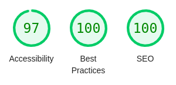

## Web
This project was crafted using the following technologies:
- <b>React:</b> A JavaScript library for building user interfaces.
- <b>TailwindCSS:</b> A low-level, utility-first CSS framework.
- <b>DaisyUI:</b> UI components for TailwindCSS.
- <b>Recharts:</b> A re-usable chart library for React.
- <b>Zustand:</b>  State management

### Getting Started
To set up the project:
1. Duplicate .env.sample and rename it to .env.
2. Install the required dependencies with `npm install`.
3. Start the development server with npm `run dev`.

### Features
  - All interactive components are keyboard accessible.
  - While the project doesn't utilize SSR, it initializes with the Cielo background and logo directly embedded within the HTML to enhance the user experience.
  - The project leverages Zustand's persistence feature to retain data fetched from the API, minimizing unnecessary requests. (https://docs.pmnd.rs/zustand/integrations/persisting-store-data)
  - Charts and tables load asynchronously for improved user responsiveness.
  - Various HTML tags, such as role, aria-label, aria-labelledby, and aria-live, are employed to enhance website accessibility.
- The majority of components have unit tests.
- graphs with screen readers (https://tailwindcss.com/docs/screen-readers)

#### Lighthouse chorme extension

## Server
This project was built using Node and Express, utilizing the routing-controller. It has only one endpoint `/transactions`, which can accept query parameters such as `status` and `cardBrand`. It will then return the filtered data based on these parameters.

### Acceptable Query Parameters
- <b>status</b>: Based on the StatusTransaction interface. Acceptable values are:
  - <b>Approved</b>: ("Corresponding to Aprovada")
  - <b>Pending</b>: ("Corresponding to Pendente")
  - <b>Denied</b>: ("Corresponding to Negada")

- cardBrand: Based on the CardBrand interface. Acceptable values are:
  - <b>MasterCard</b>
  - <b>Elo</b>
  - <b>Visa</b>
  - <b>Hipercard</b>
  - <b>Others</b>

### Getting Started

To run the project, make a copy of .env.sample to .env and choose the port on which you wish to run the application.
then run `npm install` then `npm run dev`
